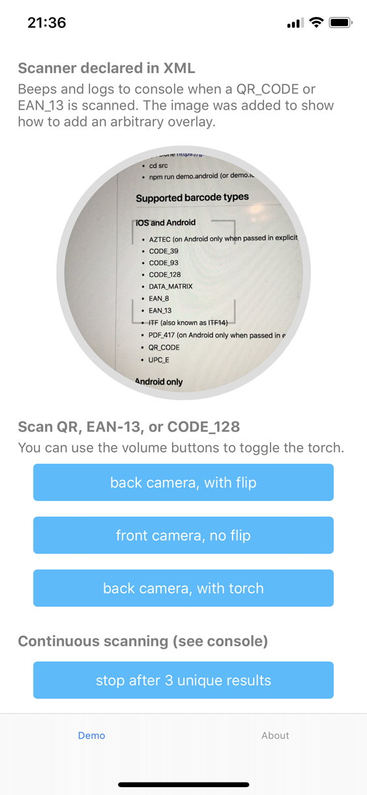

# NativeScript BarcodeScanner

[![Build Status][build-status]][build-url]
[![NPM version][npm-image]][npm-url]
[![Downloads][downloads-image]][npm-url]
[![Twitter Follow][twitter-image]][twitter-url]

[build-status]:https://travis-ci.org/EddyVerbruggen/nativescript-barcodescanner.svg?branch=master
[build-url]:https://travis-ci.org/EddyVerbruggen/nativescript-barcodescanner
[npm-image]:http://img.shields.io/npm/v/nativescript-barcodescanner.svg
[npm-url]:https://npmjs.org/package/nativescript-barcodescanner
[downloads-image]:http://img.shields.io/npm/dm/nativescript-barcodescanner.svg
[twitter-image]:https://img.shields.io/twitter/follow/eddyverbruggen.svg?style=social&label=Follow%20me
[twitter-url]:https://twitter.com/eddyverbruggen

> 💡 Plugin version 4.0.0+ is compatible with NativeScript 7+. If you need to target older NativeScript versions, please stick to plugin version 3.4.2.

> ⚠️ With 4.1.0+ you can use `beepOnScan` on iOS again (it used to crash in older 4.x versions).

## Want a quick demo?

> Note that running this only makes sense on a real device.

```bash
git clone https://github.com/EddyVerbruggen/nativescript-barcodescanner barcodedemo
cd barcodedemo/src
```

#### Fullscreen, programmatically (iOS and Android)

```bash
npm run demo.android (or demo.ios / demo.ios.device)
```

#### Embedded (iOS only)

```bash
npm run demo.ios
```

## Supported barcode types

### iOS and Android
* CODE_39
* CODE_93
* CODE_128
* DATA_MATRIX
* EAN_8
* EAN_13
* ITF (also known as ITF14)
* PDF_417 (on Android only when passed in explicity via `formats`)
* QR_CODE
* UPC_A
* UPC_E

### Android only
* CODABAR
* MAXICODE
* RSS_14

### iOS only
* AZTEC
* CODE_39_MOD_43
* INTERLEAVED_2_OF_5

### A note about `UPC_A` and `EAN_13`
When either (or both) of these are specified, both can be returned.
You can check the actual type by inspecting the `format` property of the result object.
For details, see [#176](https://github.com/EddyVerbruggen/nativescript-barcodescanner/issues/176).

## Installation
From the command prompt go to your app's root folder and execute:
```
tns plugin add nativescript-barcodescanner
```

## Embedding the scanner (iOS)

> If you need to embed the scanner for Android as well, please consider using the Machine Learning powered Barcode scanner I've added to the [ML Kit feature of the NativeScript Firebase plugin](https://github.com/EddyVerbruggen/nativescript-plugin-firebase/blob/master/docs/ML_KIT.md#barcode-scanning)!



As you can see, you can style the view any way you like, and even overlay it with an image or button.
To recreate the layout above, look at [these lines in the demo app](https://github.com/EddyVerbruggen/nativescript-barcodescanner/blob/23395bec3e5a26622146daea96dd6407a8413f70/demo/app/main-page.xml#L17-L31).

> 💡 TIP: If you don't destroy the component/page which embed the scanner (but instead show a modal, or navigate "forward") you can "pause" the scanner (since plugin version 3.4.0). Simply set that `pause` property to `true` when applicable.
 
### XML
```xml
<Page xmlns="http://schemas.nativescript.org/tns.xsd" xmlns:Barcode="nativescript-barcodescanner">
```

Here's an example tag, showing all currently supported options. The property defaults are equal to the `scan` function.

```xml
<iOS>
    <Barcode:BarcodeScannerView
      class="scanner-round"
      formats="QR_CODE, EAN_13"
      beepOnScan="true"
      reportDuplicates="true"
      preferFrontCamera="false"
      pause="{{ pause }}"
      scanResult="{{ onScanResult }}" />
</iOS>
```

### Embedding in Angular
Component / Module:

```typescript
import { registerElement } from "nativescript-angular/element-registry";
registerElement("BarcodeScanner", () => require("nativescript-barcodescanner").BarcodeScannerView);
```

View:

```html
<BarcodeScanner
      class="scanner-round"
      formats="QR_CODE, EAN_13"
      beepOnScan="true"
      reportDuplicates="true"
      preferFrontCamera="false"
      [pause]="pause"
      (scanResult)="onScanResult($event)">
</BarcodeScanner>
```

### Embedding in Vue
main.ts:

```typescript
Vue.registerElement('BarcodeScanner', () => require('nativescript-barcodescanner').BarcodeScannerView)
```

View:

```html
<BarcodeScanner
    row="1"
    height="300"
    formats="QR_CODE, EAN_13, UPC_A"
    beepOnScan="true"
    reportDuplicates="true"
    preferFrontCamera="false"
    :pause="pause"
    @scanResult="onScanResult"
    v-if="isIOS">
</BarcodeScanner>
```

See 'demo-vue' for details.

## iOS runtime permission reason
You've probably seen a permission popup like this before (this plugin will trigger one as well, automatically):


iOS 10+ requires not only this popup, but also a _reason_. In this case it's "We'd like to use the Camera ..".

You can provide your own reason for accessing the camera by adding something like this to `app/App_Resources/ios/Info.plist`:

```xml
  <key>NSCameraUsageDescription</key>
  <string>My reason justifying fooling around with your camera</string>
```

_To not crash your app in case you forgot to provide the reason this plugin adds an empty reason to the `.plist` during build. This value gets overridden by anything you specify yourself._

## Usage
Tip: during a scan you can use the volume up/down buttons to toggle the torch.

### function: scan (single mode)

#### TypeScript

```typescript
  import { BarcodeScanner } from "nativescript-barcodescanner";
  let barcodescanner = new BarcodeScanner();

  barcodescanner.scan({
    formats: "QR_CODE, EAN_13",
    cancelLabel: "EXIT. Also, try the volume buttons!", // iOS only, default 'Close'
    cancelLabelBackgroundColor: "#333333", // iOS only, default '#000000' (black)
    message: "Use the volume buttons for extra light", // Android only, default is 'Place a barcode inside the viewfinder rectangle to scan it.'
    showFlipCameraButton: true,   // default false
    preferFrontCamera: false,     // default false
    showTorchButton: true,        // default false
    beepOnScan: true,             // Play or Suppress beep on scan (default true)
    fullScreen: true,             // Currently only used on iOS; with iOS 13 modals are no longer shown fullScreen by default, which may be actually preferred. But to use the old fullScreen appearance, set this to 'true'. Default 'false'.
    torchOn: false,               // launch with the flashlight on (default false)
    closeCallback: () => { console.log("Scanner closed")}, // invoked when the scanner was closed (success or abort)
    resultDisplayDuration: 500,   // Android only, default 1500 (ms), set to 0 to disable echoing the scanned text
    orientation: orientation,     // Android only, default undefined (sensor-driven orientation), other options: portrait|landscape
    openSettingsIfPermissionWasPreviouslyDenied: true, // On iOS you can send the user to the settings app if access was previously denied
    presentInRootViewController: true // iOS-only; If you're sure you're not presenting the (non embedded) scanner in a modal, or are experiencing issues with fi. the navigationbar, set this to 'true' and see if it works better for your app (default false).
  }).then((result) => {
      // Note that this Promise is never invoked when a 'continuousScanCallback' function is provided
      alert({
        title: "Scan result",
        message: "Format: " + result.format + ",\nValue: " + result.text,
        okButtonText: "OK"
      });
    }, (errorMessage) => {
      console.log("No scan. " + errorMessage);
    }
  );
```

> Note that `result.format` above is one of [these](https://github.com/EddyVerbruggen/nativescript-barcodescanner/blob/241411a14f89171309bb94f3ca6da3bb45433e5e/src/barcodescanner-common.ts#L5).

#### JavaScript
```js
  var BarcodeScanner = require("nativescript-barcodescanner").BarcodeScanner;
  var barcodescanner = new BarcodeScanner();

  barcodescanner.scan({
    formats: "QR_CODE,PDF_417",   // Pass in of you want to restrict scanning to certain types
    cancelLabel: "EXIT. Also, try the volume buttons!", // iOS only, default 'Close'
    cancelLabelBackgroundColor: "#333333", // iOS only, default '#000000' (black)
    message: "Use the volume buttons for extra light", // Android only, default is 'Place a barcode inside the viewfinder rectangle to scan it.'
    showFlipCameraButton: true,   // default false
    preferFrontCamera: false,     // default false
    showTorchButton: true,        // default false
    beepOnScan: true,             // Play or Suppress beep on scan (default true)
    fullScreen: true,             // Currently only used on iOS; with iOS 13 modals are no longer shown fullScreen by default, which may be actually preferred. But to use the old fullScreen appearance, set this to 'true'. Default 'false'.
    torchOn: false,               // launch with the flashlight on (default false)
    closeCallback: function () { console.log("Scanner closed"); }, // invoked when the scanner was closed (success or abort)
    resultDisplayDuration: 500,   // Android only, default 1500 (ms), set to 0 to disable echoing the scanned text
    orientation: "landscape",     // Android only, optionally lock the orientation to either "portrait" or "landscape"
    openSettingsIfPermissionWasPreviouslyDenied: true // On iOS you can send the user to the settings app if access was previously denied
  }).then(
      function(result) {
        console.log("Scan format: " + result.format);
        console.log("Scan text:   " + result.text);
      },
      function(error) {
        console.log("No scan: " + error);
      }
  );
```

### function: scan (bulk / continuous mode)
In this mode the scanner will continuously report scanned codes back to your code,
but it will only be dismissed if the user tells it to, or you call `stop` programmatically.

The plugin handles duplicates for you so don't worry about checking those;
every result withing the same scan session is unique unless you set `reportDuplicates` to `true`.

Here's an example of scanning 3 unique QR codes and then stopping scanning programmatically.
You'll notice that the Promise will no longer receive the result as there may be many results:

#### JavaScript
```js
  var count = 0;
  barcodescanner.scan({
    formats: "QR_CODE",
    // this callback will be invoked for every unique scan in realtime!
    continuousScanCallback: function (result) {
      count++;
      console.log(result.format + ": " + result.text + " (count: " + count + ")");
      if (count === 3) {
        barcodescanner.stop();
      }
    },
    closeCallback: function () { console.log("Scanner closed"); }, // invoked when the scanner was closed
    reportDuplicates: false // which is the default
  }).then(
      function() {
        console.log("We're now reporting scan results in 'continuousScanCallback'");
      },
      function(error) {
        console.log("No scan: " + error);
      }
  );
```

### function: available
Note that the iOS implementation will always return `true` at the moment,
on Android we actually check for a camera to be available.

#### JavaScript
```js
  var barcodescanner = require("nativescript-barcodescanner");

  barcodescanner.available().then(
      function(avail) {
        console.log("Available? " + avail);
      }
  );
```

### function: hasCameraPermission / requestCameraPermission
On Android 6+ you need to request permission to use the camera at runtime when targeting API level 23+.
Even if the `uses-permission` tag for the Camera is present in `AndroidManifest.xml`.

On iOS 10+ there's something similar going on.

Since version 1.5.0 you can let the plugin handle this for you
(if need be a prompt will be shown to the user when the scanner launches),
but if for some reason you want to handle permissions yourself you can use these functions.

#### JavaScript
```js
  barcodescanner.hasCameraPermission().then(
      function(granted) {
        // if this is 'false' you probably want to call 'requestCameraPermission' now
        console.log("Has Camera Permission? " + result);
      }
  );

  // if no permission was granted previously this wil open a user consent screen
  barcodescanner.requestCameraPermission().then(
      function() {
        console.log("Camera permission requested");
      }
  );
```

### Usage with `nativescript-angular`

You may have injected the `BarcodeScanner` class in your component constructor in the past,
but please don't do that anymore because in release builds you may experience a crash.

So instead of:

```typescript
// my-component.ts
import { Component, Inject } from '@angular/core';
import { BarcodeScanner } from 'nativescript-barcodescanner';

@Component({ ... })
  export class MyComponent {
    constructor(private barcodeScanner: BarcodeScanner) {
  }

  //use the barcodescanner wherever you need it. See general usage above.
  scanBarcode() {
    this.barcodeScanner.scan({ ... });
  }
}
```

Simply do:

```typescript
// my-component.ts
import { Component, Inject } from '@angular/core';
import { BarcodeScanner } from 'nativescript-barcodescanner';

@Component({ ... })
  //use the barcodescanner wherever you need it. See general usage above.
  scanBarcode() {
    new BarcodeScanner().scan({ ... });
  }
}
```

#### Webpack usage
If you run into an error when Webpacking, open `app.module.ts` and add this:

```typescript
import { BarcodeScanner } from "nativescript-barcodescanner";

export function createBarcodeScanner() {
  return new BarcodeScanner();
}

providers: [
  { provide: BarcodeScanner, useFactory: (createBarcodeScanner) }
]
```

## Troubleshooting
If you get the error `TypeError: Cannot read property 'zxing' of undefined` on android, try the following steps:
1. Delete the app from your device
2. Remove the folder `platforms/android`. This triggers a complete rebuild
3. run `tns run android`

## Dependencies / Related Projects

This plugin wraps libaries for Android and iOS to make the barcode scanner easily accessible via a unified API. The Libraries used are:

### iOS

Custom Framework to access iOS APIs: https://github.com/EddyVerbruggen/ios-framework-barcodescanner

### Android

ZXing: https://github.com/zxing/zxing/releases

As using that library as a direct dependency was not practical, there is a library-project that adopts the sources from ZXing and copiles them into a AAR for usage on android: https://github.com/EddyVerbruggen/barcodescanner-lib-aar/
